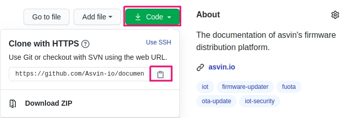
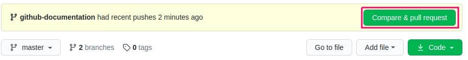

# GitHub-Beitragsrichtlinien

## Github-Konto erstellen

Die Codebasis der Asvin-Plattform wird auf GitHub entwickelt und gepflegt. Um einen Beitrag für das 
Asvin-Projekt leisten zu können, muss man ein GitHub-Konto erstellen. Um das Konto zu erstellen, gehen 
Sie zu [GitHub](https://github.com/) und melden Sie sich mit Benutzernamen, E-Mail und Passwort an.


## Fork Repository

Asvin besteht aus mehreren Komponenten, die in entsprechenden Repositories entwickelt werden. Wenn 
Sie anfangen, etwas beizutragen, ist es empfehlenswert, das Repository zu forken, Ihre Änderungen 
vorzunehmen und einen Pull-Request einzureichen. Dies hilft dabei, den Quellcode im Master-Zweig wartbar, 
sauber und stabil zu halten. Das Forken eines Projektarchivs führt zu einer identischen Kopie des Projektarchivs 
in Ihrem persönlichen Konto. Damit haben Sie die volle Kontrolle über das Projektarchiv, um Änderungen am 
Quellcode vorzunehmen. Sobald Sie mit Ihren Änderungen zufrieden sind, können Sie einen Pull-Request an das 
offizielle Projektarchiv von Asvin senden.


Wie forked man eine Repository?

-	Öffnen Sie Ihren Browser und gehen Sie zu dem Repository von Asvin, das Sie forken möchten
- Klicken Sie auf die Schaltfläche fork in der oberen rechten Ecke

  

- Wählen Sie Ihren GitHub-Account aus und das Repository wird automatisch geforkt und landet im geklonten Repository in Ihrem Account

## Repository klonen 

Nach dem Forking-Prozess haben Sie ein Repository in Ihrem Konto. Der nächste Schritt besteht darin, 
das Repository auf Ihr lokales System zu klonen. Nach dem Klonprozess haben Sie die Quelldateien auf 
Ihrem lokalen Rechner und können sie in Ihrer bevorzugten IDE zur Entwicklung öffnen.

Wie klont man ein Repository?

- Öffnen Sie Ihren Browser und gehen Sie zu dem Projektarchiv in Ihrem Konto, das Sie klonen möchten.
- Klicken Sie auf die Schaltfläche Code in der Mitte rechts und kopieren Sie die Web-URL clone
  
- Öffnen Sie Ihr Terminal und wechseln Sie in das Verzeichnis, in das Sie klonen möchten
- Verwenden Sie git clone `git clone <web-url>` z. B. `git clone https://github.com/b-rohit/documentation.git`
- Gehen Sie zum Repository-Verzeichnis und fügen Sie das ursprüngliche Asvin-Repository als entferntes Upstream-Repository hinzu

  Für ein Beispiel-Framework-Repository:

  ```
  cd documentation
  git remote add upstream https://github.com/Asvin-io/documentation.git
  ```

- Sie können alle entfernten Repositorys mit folgendem Befehl überprüfen

  ```
  git remote -v
  ```

  Ein Beispiel für die Ausgabe des Befehls für das Framework-Repository

  ```
  origin	https://github.com/b-rohit/documentation.git (fetch)
  origin	https://github.com/b-rohit/documentation.git (push)
  upstream	https://github.com/Asvin-io/documentation.git (fetch)
  upstream	https://github.com/Asvin-io/documentation.git (push)

  ```

Jetzt ist alles erledigt, sodass Sie aktiv an der asvin Plattform mitarbeiten können. 
## Feature-Branch erstellen

Alle asvin-Komponenten-Repositories haben einen Hauptzweig namens `master`. Der `Master-Branch` enthält 
den stabilen Code der Komponente. Die Hauptidee hinter der Verwendung eines Feature-Branches für die 
Entwicklung ist, den Master-Branch von fehlerhaftem Code in einem neuen Feature unberührt zu lassen. 
Ein Entwickler sollte einen Funktionszweig in seinem Fork-Repository erstellen, um eine neue Funktion 
zu entwickeln, ein Problem zu beheben, Änderungen vorzunehmen usw. Ein Funktionszweig bietet eine Abkapselung 
von der Haupt-Codebasis. Das bedeutet, dass der `Master-Branch` von Fehlern, die durch fehlerhaften Code eines 
neuen Commits verursacht werden, isoliert ist. Er hält die Hauptcodebasis sauber und stabil.

Wie erstellt man einen Feature-Branch?

- Holen Sie Commits, Dateien und Refs aus dem Upstream-Repository
  ```
  git fetch upstream
  ```
- Auschecken in den `Master` Branch
  ```
  git checkout master
  ```
- Upstream-Änderungen in den lokalen Master-Branch einbinden
  ```
  git merge upstream/master
  ```
- Änderungen auf den entfernten Master-Zweig im geforkten Repository übertragen
  ```
  git push origin master
  ```
- Jetzt haben Sie Ihren origin/master und upstream/master synchronisiert. Dieser Prozess stellt sicher, 
  dass es keine Diskrepanzen  zwischen den beiden Zweigen gibt und der neue Feature-Branch eine exakte Kopie davon ist.
  ```
  git checkout -b <feature_branch_name>
  ```

Damit haben Sie einen neuen Feature-Branch, in dem Sie Änderungen vornehmen können.
## Änderungen in das Forked Repository übertragen

Wenn Sie mit dem Erstellen einer neuen Funktion oder dem Beheben eines Problems in Ihrem 
Funktions-Branch fertig sind, ist es an der Zeit, die Änderungen zu übertragen und in das 
geforkte Repository zu schieben. Dieser Prozess speichert den Status im Remote-Branch im 
Forked Repository. Später wird dieser Status verwendet, um eine Pull-Anfrage für das 
Asvin-Komponenten-Repository zu erstellen.

Wie wird gepusht?

- Fügen Sie Ihre geänderten, gelöschten und neuen Dateien in den Index ein
  ```
  git add <file1> <file2>
  ```

- Sie können nun den aktuellen Inhalt des Indexes übertragen. Dadurch wird ein Schnappschuss der 
  aktuellen Änderungen des Projekts erstellt. Ihre Commit-Nachricht muss die folgenden Informationen enthalten:
  - eine einzeilige Zusammenfassung der Änderungen in diesem Commit als Titel, 	gefolgt von einer Leerzeile
  - Erläutern Sie im Nachrichtentext, warum diese Änderung notwendig ist, und wie Sie sie angegangen sind. Dies hilft den Reviewern, Ihren Code besser zu verstehen und beschleunigt oft den Review-Prozess.

  ```
  git commit -s
  ```
- Verschieben Sie die Änderung in Ihr geforktes Repository

  ```
  git push origin <feature_branch_name>
  ```

Am Ende dieses Prozesses haben Sie eine neue Funktion entwickelt oder einen Fehler behoben 
und in Ihr Forked-Repository verschoben. In diesem Moment sind Ihre Änderungen im Forked 
Repository bereit, in das asvin-Komponenten-Repository integriert zu werden. Dies kann durch 
einen Pull-Request an das Asvin-Repository geschehen.

## Eröffnen eines Pull-Requests in GitHub

Sobald Sie Ihre Änderungen in den Feature-Branch Ihres Forked Repositories gepusht haben, 
können Sie nun einen Pull-Request gegen das ursprüngliche Asvin-Komponenten-Repository öffnen. 
Dies wird die einfachste aller Aufgaben sein, die Sie bisher in diesem Thread erledigt haben.


Wie öffnet man eine Pull-Anfrage?

-	Navigieren Sie zu Ihrem geforkten Repository `https://github.com/<Benutzername>/<forked_repository>`.
-	Bei neuen Änderungen wird automatisch angezeigt, dass es einige Unterschiede zwischen dem forked und 
  dem ursprünglichen Repository gibt. Klicken Sie auf `Compare & pull request`. 
  
- Sie werden zum ursprünglichen Asvin-Repository navigiert. Hier können Sie den Titel und die Kommentarnachricht 
  ändern, wenn Sie möchten, und auf `Create Pull Request` klicken. .
  

Sehr gut! Sie öffnen gerade Ihren ersten Pull Request im Asvin Projekt. Der Pull-Request wird geprüft und in das ursprüngliche Asvin-Repository zusammengeführt.

## Feature-Branch löschen

Wenn Sie mit Ihrem Feature fertig sind und Ihr Pull-Request akzeptiert und in das ursprüngliche 
asvin-Repository zusammengeführt wurde, ist es an der Zeit, Ihr geforktes Repository zu bereinigen. 
Sie müssen den Feature-Branch aus Ihrem lokalen und entfernten geforkten Projektarchiv löschen.

Wie werden lokale und entfernte Verzweigungen gelöscht?

- Löschen Sie Ihren lokalen Funktionszweig

  ```
  git branch -d <feature_branch_name>
  ```

- Verschieben Sie Ihre Änderungen in den entfernten Zweig

  ```
  git push --delete origin <feature_branch_name>
  ```

## Synchronisierung der Forked Repository mit dem Original

Asvin ist ein vollständig gemeinschaftsbasiertes Projekt. Daher wird die Hauptcodebasis ständig Änderungen von anderen Entwicklern erhalten. Das bedeutet, dass Sie Ihr Forked Repository mit dem originalen Asvin Repository synchronisieren müssen. Auf diese Weise vermeiden Sie Merge-Konflikte.

Wie wird synchronisiert?

- Ziehen Sie die Änderungen aus dem Upstream-Repository
  ```
  git fetch upstream
  ```
- Rebasieren Sie das lokale origin/master mit upstream/master
  ```
  git rebase upstream/master
  ```
- Verschieben Sie die Änderungen in das geforkte Repository
  ```
  git push origin master
  ```
