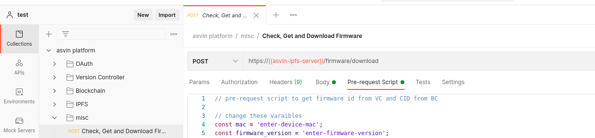

Firmware Download
=================

After you have an active rollout in your account, you can download the associated firmware. We have created a request in misc folder in the asvin
postman collection. The request is named Check, Get and Download Firmware. Firstly, open the request and go to Pre-request Script tab. Secondly, 
enter valid MAC address and firmware version as shown in the image below. Lastly, click on Send button to send the request.

The one click firmware download request is more complicated than it seems. Under the hood, it contains 4 more requests. First of all, it sends login
request to OAuth server to get JWT. The JWT is used in all subsequent requests for authorization. After that it checks for an active rollout. If a 
rollout exist the Version Controller returns firmware and rollout ids. The firmware id is utilized to get firmware CID from the Blockchain Server. 
Finally, it sends download firmware request with CID to the IPFS server. You can see the details of all requests in the Postman Console. It is 
depicted in the image below.

.. image:: ../images/download-firmware.png
            :width: 500pt
            :align: center

You can also make the requests manually one by one. It is illustrated in the video below.

.. raw:: html

  <video width="710" autoplay muted loop>
  <source src="../_static/videos/firmware-download.m4v" type="video/mp4">
  Your browser does not support the video tag.
  </video>

You will have your first firmware downloaded at the completion of the task.