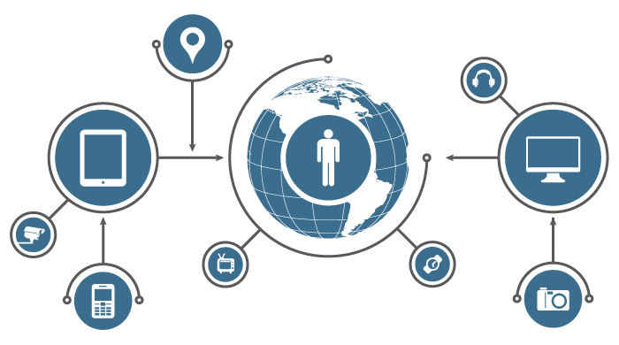

===========
Einleitung
===========

Es gab eine Zeit, in der die Zubereitung von Kaffee ein breites Spektrum an Aufgaben erforderte. 
Zuerst ging man auf den Markt, um frisch geröstete, aromatische Kaffeebohnen zu kaufen, dann mahlte 
man sie und während der Kaffee brühte, holte man die Zeitung von der Haustür und begann seinen Tag, 
während man darauf wartete, dass der Kaffee "aufholte". Spulen Sie ins Jahr 2021 vor, und unsere 
"intelligente" Kaffeemaschine überwacht unser Armband, um festzustellen, ob wir wach sind, so dass zu 
dem Zeitpunkt, an dem wir die Küche erreichen, unsere handwerklich hergestellten Kaffeebohnen bereits 
frisch geröstet, gemahlen und genau nach unseren Vorlieben gebrüht wurden. Dazu kommt, dass diese Kaffeemaschine 
nun überwachen kann, wie viel Kaffee noch im Trichter ist, unsere Lieblingsbohnen bei einem bevorzugten Verkäufer 
bestellen kann und die Bezahlung automatisch mit den im Gerät gespeicherten Kreditkartendaten vornimmt

Wir sind von vielen intelligenten Geräten wie unserer Kaffeemaschine umgeben. Ausgestattet mit drahtlosen 
Kommunikationsprotokollen wie WiFi, Bluetooth, NFC, LoRaWAN usw. sprechen diese intelligenten Geräte miteinander 
und sind mit dem Internet verbunden und werden als Geräte des Internet-of-Things (IoT). IoT-Geräte sind heute in 
unserem Leben omnipräsent- ob in unseren Häusern, Städten, Arbeitsplätzen oder in Krankenhäusern. Wir leben in einer 
Zeit, in der intelligente Geräte häufiger mit uns kommunizieren und interagieren als andere Menschen. Bis zum Jahr 
2030 werden die Anzahl der IoT-Geräte und die Größe des IoT-Marktes voraussichtlich 125 Milliarden bzw. 1,3 Billionen 
USD erreichen.

IoT-Geräte vereinfachen Prozesse und machen unser Leben bequemer. Andererseits sind diese Geräte anfällig für Cyber-Sicherheitsbedrohungen. 
Wenn beispielsweise jemand unsere harmlos aussehende smarte Kaffeemaschine hackt, könnte sie unsere WLAN-Anmeldeinformationen, Kreditkartendaten, 
Schlafgewohnheiten und viele weitere persönliche Daten preisgeben, aber sie kann auch als Bot verwendet werden, um Cybersicherheitsangriffe auf 
andere digitale Ressourcen zu starten. Mirai-2016 beispielsweise verwandelte über sechs Millionen vernetzte Geräte in ein Botnet, um DDoS-Angriffe 
zu starten. Diese Arten von Angriffen haben das exponentielle Wachstum von IoT-Geräten aus einer Vielzahl von Gründen überholt, darunter die 
Verwendung von Standard- oder schwachen Passwörtern, kleinen Encryption Keys oder das Versäumnis, Sicherheitspatches und Software-Updates herunterzuladen.

Eines der größten Sicherheitsprobleme ist, dass IoT-Geräte keine eingebauten Over-the-Air (OTA)-Firmware-Update-Mechanismen haben. IoT-Geräte werden 
mit einer "Set and Forget"-Politik hergestellt und verwaltet, d. h. IoT-Geräte werden zu Beginn ihres Lebenszyklus konfiguriert und dann allein 
gelassen, um sich gegen Sicherheitsangriffe zu schützen. Technologien entwickeln sich so schnell weiter, dass es von größter Bedeutung ist, einen 
gut definierten, sicheren Prozess zu haben, um die Bedrohungslandschaft von IoT-Geräten kontinuierlich zu bewerten und die Firmware regelmäßig mit 
den neuesten Sicherheits-Patches zu aktualisieren.

In den letzten paar Jahren gab es große Entwicklungen im Bereich der Update-Plattformen für IoT-Geräte. 
Einige Lösungen, wie z. B. Eclipse hawkBit, Mbed und Mender, adressieren das bestehende Problem, aber ihre 
Lösungen sind auf eine bestimmte Mikrocontroller-Architektur beschränkt, Software-Stacks und Branchen sind als 
zentralisierte Lösungen konzipiert und entwickelt, die anfällig für Single-Point-Failure sind und nicht sehr gut 
zu skalieren. In den folgenden Abschnitten wird beschrieben, wie sich die Device Security Booster von anderen 
IoT-Update-Lösungen unterscheidet.

Device Security Booster
##############

Die Device Security Booster ist eine Cloud-Plattform der Enterprise-Klasse, die mit Distributed Ledger Technology (DLT) entwickelt 
wurde, um Patches zu verteilen und eine Vertrauenskette für IoT-Geräte zu erzeugen. Die Plattform basiert auf **verteilten** 
und **dezentralen** Technologien und nutzt das Interplanetary Filesystem (IPFS) zur Speicherung und Verwaltung der Firmware-Dateien 
von IoT-Geräten. Alle Firmware-Dateien und Patches sind über mehrere IPFS-Knoten verteilt, während die kritischen 
Metadaten-Informationen der jeweiligen Geräte in einem unveränderlichen Distributed Ledger (DL) gespeichert werden, ebenso wie 
jedes Ereignis, das auf der Plattform stattfindet. Diese Technologien erhöhen die Fehlertoleranz der Plattform und machen 
sie sowohl leichter zugänglich als auch ausfallsicherer.
 
Es ist eine Sache, einen funktionierenden Prototyp eines IoT-Produkts zu haben und eine andere, Millionen von intelligenten 
Geräten zu verwalten und zu aktualisieren. Die wünschenswerteste Eigenschaft jeder IoT-Lösung ist Skalierbarkeit. Asvin bietet 
diese Lösung - effektiv und effizient.
Die Device Security Booster verfügt über eine hochgradig **anpassbare** und **modulare** Architektur und wurde so konzipiert und entwickelt, 
dass sie mit ihren steckbaren Modulen, die für den jeweiligen Anwendungsfall optimiert sind und so IoT-Anwendungen in verschiedenen 
Branchen unterstützt.
Im Gegensatz zu anderen FUOTA-Lösungen ist die Plattform eine **universelle** Lösung, die keine Einschränkungen für beliebige 
Hardware- und Software-Stacks mit sich bringt. asvin ermöglicht die Innovation und Vielseitigkeit jeder IoT-Anwendung, die mit Atmel 
AVR bis ARM Cortex M7 gebaut wurde, in Anwendungen von der Landwirtschaft bis zu Finanzdienstleistungen.

