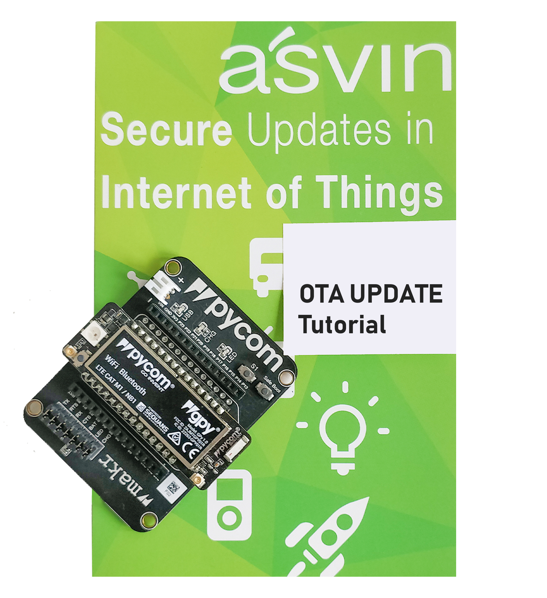

==========================================
Over the air updates mit Pycom Gpy boards
==========================================

In diesem Tutorial sehen wir die Demonstration von OTA-Updates mit der asvin 
IoT-Plattform und dem *Gpy* Board von Pycom.

Requirements
############

1. Pycom `Gpy board <https://pycom.io/product/gpy/>`_
2. Pycom `Erweiterungskarte <https://pycom.io/product/expansion-board-3-0/>`_ 
3. Micro USB Kabel
4. Asvin plattform Zugang 
5. `Pymakr <https://marketplace.visualstudio.com/items?itemName=pycom.Pymakr>`_ VScode-Erweiterung

Erste Schritte
###############

Um zu beginnen, gehe zu `asvin's Github repository <https://github.com/asvin-io/asvin-tutorials>`_ und 
klone es. Öffne den Ordner *pycom-ota-updates* in VScode. Achte darauf, dass Sie die aktualisierte Firmware 
auf deinem Pycom *Gpy* und dem *Expansion* Board haben.

1.  *Beschreibung der Dateien*:
    
    Dieses Repository enthält ein paar Python Sketches. Unten ist eine kurze Beschreibung von ihnen

    *lib/OTA.py*
        Diese Bibliothek ermöglicht OTA-Updates. Sie wird unten im Detail besprochen.
    
    *connect_wifi.py*
        Dieses Skript ist ein Wrapper um die pycom Wlan() Bibliothek
    
    *asvin.py*
        Diese Datei enthält Funktionen, um verschiedene API's der Asvin Plattform aufzurufen.
    
    *config.py*
        Diese Datei enthält verschiedene Benutzerkonfigurationsoptionen und wird im nächsten Abschnitt besprochen

2.  Als nächstes müssen einige Parameter in der config.py Datei überarbeitet werden. 

    - Öffne die config.py Datei im Editor und füge die Anmeldedaten für dein Gerät hinzu

    .. image:: ../images/configpy.jpg
        :width: 400pt
        :align: center
        :alt: configpy

    - Ergänzen Sie unter “Asvin Credentials” folgende Informationen
        - customer_key:     siehe asvin Plattform
        - device_key:       siehe asvin Plattform
      
    - Ergänzen Sie unter „WiFi Credentials“ folgende Angaben SSID und Passwort
    
    - Zusätzlich kann die Farbe der LED in der Konfigurationsdatei eingestellt werden.

    
3.	Laden Sie nun das Projekt aufs Pycom Board hoch

4.  Der Code führt folgende Schritte aus: :
        - WiFi-Verbindung
	    - Prüfung, ob der vorherige *Rollout* erfolgreich ausgeführt wurde
        - Registrierung des Gerätes durch Aufruf der :ref:`Register Device` API.
        - Prüfung auf neuen Rollout  Rollout vorhanden!
        - Herunterladen und Ausführung des Updates. 

        
5.  **Einrichtung des OTA**

    Follow the steps below along with the :doc:`../getting-started/customer-platform` guide. 
    
    1.  *Gerät registrieren*:
            Die Registrierung erfolgt automatisch beim Booten

    2.  *Gerätegruppe*:
            Bitte richten Sie eine Gerätegruppe auf der asvin Plattform ein.

    3.  *Dateigruppen*:
            
            Bevor Dateien zum Rollout in eine Dateigruppe hochgeladen werden können, müssen bestimmte Änderungen an 
            Dateien vorgenommen werden: Integrieren der folgenden zwei Zeilen zu Beginn des Codes

            ::

                path="/flash/config.py"
                version = "0.0.1"
                """
                Asvin OTA Config File
                """

                
            In diesem Fall ist die Path-Variable der Pfad der Variable im Dateisystem von Pycom. Die Version ist 
            die benutzerdefinierte Versionsnummer der vorhandenen Datei.

    4.  *Rollout*:
            Setup the rollout as mentioned in the `Getting Started <https://asvin.readthedocs.io/en/latest/getting-started/getting-started.html>`_ guide.
            In this case it is important to follow the guidelines mentioned under *File Groups*.

            Richten Sie das Rollout wie in der Anleitung `Erste Schritte <https://asvin.readthedocs.io/en/latest/getting-started/getting-started.html>`_ 
            beschrieben ein. In diesem Fall ist es wichtig, die unter Dateigruppen genannten Richtlinien zu befolgen.

Der OTA-Rollout für das Pycom Gpy-Board wurde erfolgreich abgeschlossen. Den vollständigen Code und die 
Dateien finden Sie in asvin's `Github repository <https://github.com/asvin-io/asvin-tutorials>`_. 