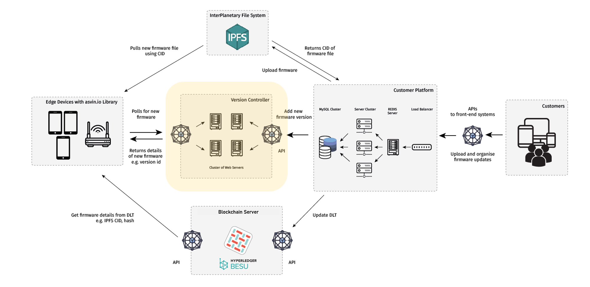

==================
Version Controller
==================

In diesem Abschnitt werden wir einen kurzen Blick auf die Komponenten des **Version Controllers** der asvin 
Architektur werfen. Vereinfacht ausgedrückt enthält der Version Controller (VC) aktuelle Informationen über 
die verfügbare Firmware für ein bestimmtes Edge-Gerät oder eine Gerätegruppe auf der asvin.io Plattform.

Um Milliarden von IoT-Edge-Geräten zu verwalten, setzt asvin.io.io eine verteilte Service-Cluster-Infrastruktur 
ein. Für die Edge-Geräte ist diese Komplexität nicht ersichtlich, sie interagieren mit dem Cluster wie mit einer 
einzelnen Maschine. Der Version Controller Server besteht aus mehreren Knoten, die eine Kopie des Webservers haben 
und identische Webservices hosten. Jeder Knoten im Cluster ist ein voll funktionsfähiger Webserver mit einer 
eindeutigen IP-Adresse und kann jede Anfrage unabhängig bedienen, aber sie sind für die Edge-Devices nicht sichtbar. 
Um diese Komplexität zu verbergen, wird eine Abstraktionsschicht, bestehend aus einer Round-Robin DNS2 Technik für 
Lastausgleich, Fehlertoleranz und Lastverteilung, wird über dem Cluster verwendet. Der Server nimmt DNS-Anfragen an 
und leitet sie an eine Rechenmaschine im Cluster weiter. Eine Maschine aus dem Cluster wird dann im Round-Robin-Verfahren 
ausgewählt.

Schlüsselfunktionen des Version-Controllers: 

**Ausfallsicherheit**

Die zweischichtige Architektur des VC-Servers bietet Schutz vor Single Point Failure. Falls ein Knoten 
im Cluster ausfällt, bleibt das asvin.io Framework betriebsbereit.

**Skalierbarkeit**

Der Cluster ist hoch skalierbar und stabil. Um die Leistung des VC-Servers zu erhöhen, kann einfach ein 
neuer Knoten im Cluster installiert werden.

**Effizienz**

Der Version Controller verteilt die Arbeitslast auf mehrere Webserver im Cluster, was die Netzwerkleistung 
verbessert und Latenz und Kollisionen in Zeiten hoher Nachfrage reduziert. Der Version Controller bietet 
Ausfallsicherheit für das asvin.io Netzwerk.

Funktionen des Servers: 

1. **Abfrage nach Updates/ Firmware**

Die Edge-Devices fragen den Versionskontroller ab, um auf ein neues Update zu prüfen. Der VC und der 
Server antworten dem Edge-Device mit der Information über eine gültige Firmware.

2. **Verwaltung der Firmware-Versionen**

Der Version Controller verwaltet Echtzeit-Informationen über verschiedene Versionen der auf den Servers 
verfügbaren Firmware. Außerdem verfügt er über eine Liste der verfügbaren Firmware für alle Edge-Devices 
auf der asvin-Plattform. Er hält die Liste durch Interaktion mit dem Kundenplattform aktualisiert.