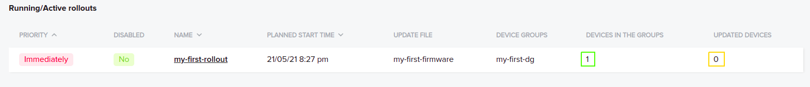
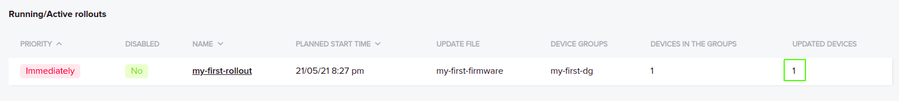

Rollout Success
===============

Now that you have downloaded a firmware, you can install it on the device. Once the installation is completed and device works as expected, you should
send rollout success request to the Version Controller. A rollout is associated with a device group. Therefore, an active rollout shows the number of 
devices in the groups and updated devices as shown in the picture below.

In the beginning, an active rollout has 0 updated devices. It gets updated when a rollout success request is sent with valid parameters. You can send
the request using postman collection. It is in the Version Controller folder with the name Rollout Success. The request requires 4 parameters in the
body. They are device mac address, firmware version and rollout ID. You must have received rollout ID in response to the next rollout request. The 
response looks similar to the following.

.. code-block:: json

   {
     "rollout_id": "63",
     "rollout_name": "my-first-rollout",
     "priority": "1",
     "start_date": "2021-05-21 18:27:31",
     "version": "1.0",
     "firmware_id": "57"
   }

The rollout success request is shown in the video below.

.. raw:: html

  <video width="710" autoplay muted loop>
  <source src="../_static/videos/rollout-success.m4v" type="video/mp4">
  Your browser does not support the video tag.
  </video>

Once the rollout success request is completed, the updated device count is changed in the rollout as shown in the image below.

